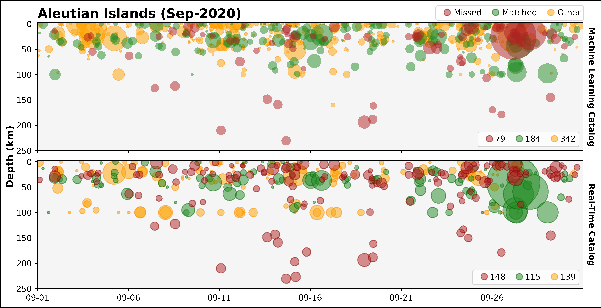

# study_catalogs
All study catalogs, Antelope parameter files, and catalog comparison keys for Noel &amp; West, 2025 (in prep).

Directory Structure:
```bash
.
├── study
│   ├── antelope_parameter_files
│   ├── catalog_comparison_keys
│   └── catalogs
│       ├── analyst_reviewed
│       ├── machine_learning
│       └── real_time
```

## Catalog Plots
Catalog comparison plots for each study, listed in alphabetical order.



